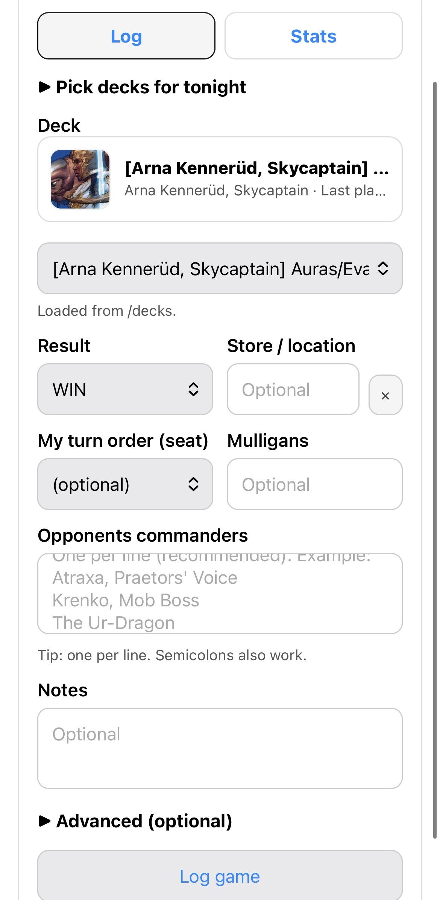
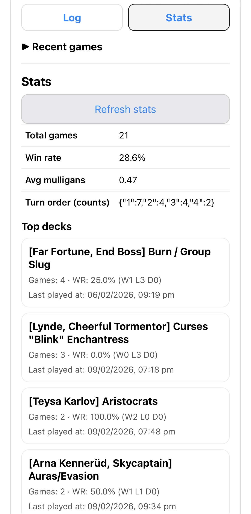
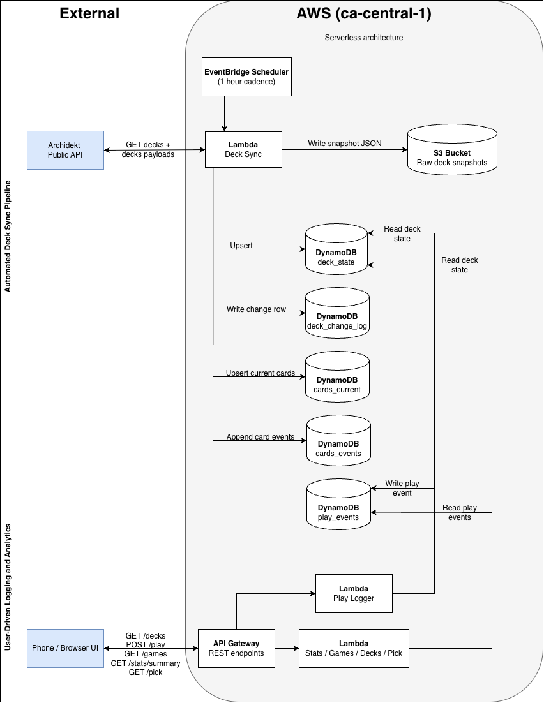
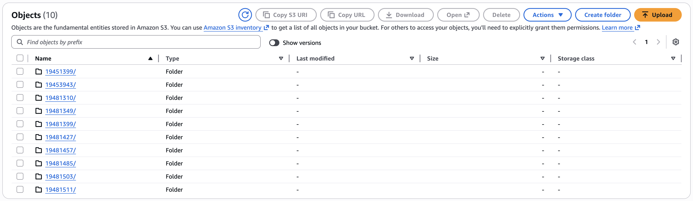
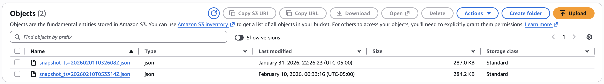
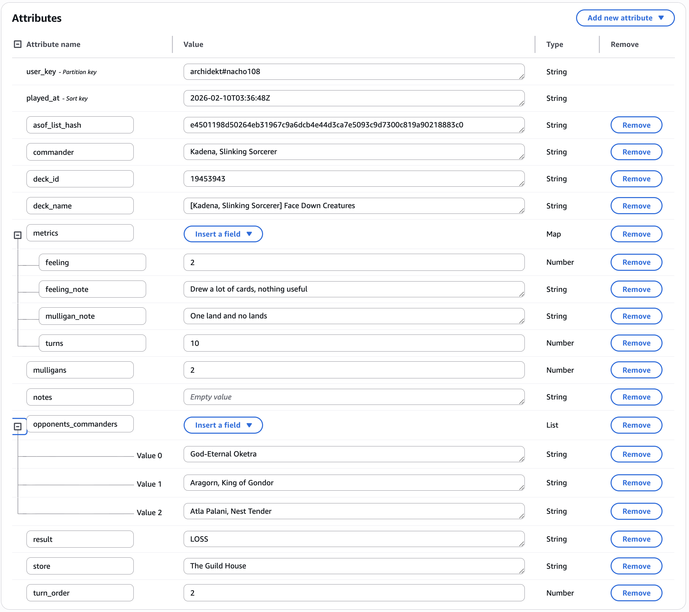
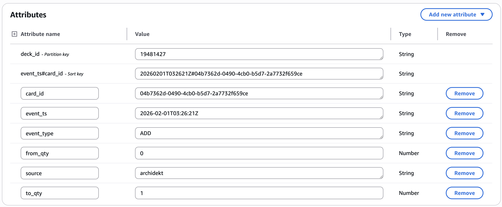
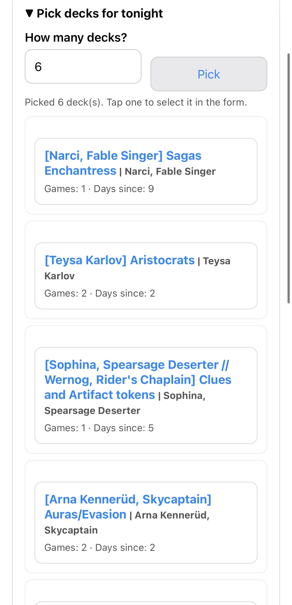

# Magic: the Gathering Commander Tracker (AWS Serverless Data Platform)

## Project Overview

This project is a serverless data engineering application that tracks my Magic: the Gathering Commander decks and real gameplay results.

It combines:
- Automated deck ingestion from Archidekt
- Event-based logging from a mobile-friendly UI
- Historical change tracking at deck and card level
- Lightweight analytics endpoints for feedback loops

The goal was to design and implement an end-to-end data platform using AWS services, modeling both **current state** and **event history** in a scalable way.

Unlike my analytics-focused projects, this one emphasizes:
- API ingestion
- Event modeling
- DynamoDB schema design
- Change detection
- Serverless architecture

### User Interface

Mobile-first interface to:
- Log games
- Track results
- View deck statistics
- Randomly pick decks

---

## Objectives

- Automate ingestion of public deck data from Archidekt
- Track deck changes over time
- Store raw snapshots for auditability
- Log real-world play events from a phone
- Associate play outcomes with specific deck states
- Expose analytics endpoints for quick iteration
- Design a schema that supports future expansion

---

## Architecture Overview

### 1. Deck Sync Pipeline
A scheduled AWS Lambda function runs on a fixed cadence using EventBridge Scheduler.

The Lambda:
1. Calls the Archidekt API
1. Fetches deck metadata and full deck payloads
1. Normalizes the mainboard into a stable structure
1. Generates a SHA256 hash for change detection
1. Stores raw snapshots in Amazon S3
1. Updates DynamoDB tables for state and change tracking

This allows automatic detection of:
- Added cards
- Removed cards
- Quantity changes

---

## Architecture Diagram

_Serverless architecture separating automated deck ingestion from user-driven play logging and analytics._

### Raw Snapshot Storage

Each sync stores a timestamped JSON snapshot if there is a new deck or a change to an existing one:
archidekt/user/&lt;user&gt;/decks/&lt;deck_id&gt;/snapshot_ts=YYYYMMDDTHHMMSSZ.json

---

### 2. Play Events Logging
A mobile-friendly HTML + JavaScript form submits game data through API Gateway to a Lambda function.

Each play event stores:
- deck_id
- result (WIN / LOSS / DRAW)
- played_at (stored in UTC)
- opponents_commanders (list)
- turns
- mulligans
- turn_order
- Optional metadata (store, feeling, notes, etc.)
- asof_list_hash (deck snapshot reference)

Timestamps are stored in UTC but rendered in the user's local timezone in the UI.

---

## Data Modeling (DynamoDB)
The system separates **current state** from **immutable events**, following event-driven modeling principles.

Play events store immutable game results.

Card events track ADD / REMOVE / QTY_CHANGE over time.

### 1. Deck State Table
Stores the latest known version of each deck:
- deck_id (PK)
- name
- commander
- featured_image
- list_hash
- normalized_mainboard
- last_seen_at

Used for UI dropdowns and freezing deck state at play time.

---

### 2. Deck Change Log
Store one row per deck update event
- deck_id
- changed_at
- change_type (CREATED / UPDATED)
- diff_summary
- list_hash

Provides auditability and change tracking.

---

### 3. Cards Current
Tracks current card presence per deck:

**PK:** deck_id

**SK:** card_id

Attributes:
- qty
- first_seen_at
- last_added_at
- last_removed_at
- in_deck (boolean)

Supports queries like:
- Which cards have been in this deck the longest?
- When was this card last removed?

---

### 4. Card Events
Immutable log of card-level events:
- ADD
- REMOVE
- QTY_CHANGE

Enables reconstruction of deck evolution over time.

---

### 5. Play Events
**PK:** user_key ({source}#{username})

**SK:** played_at

Stores one row per game:
- deck_id
- result
- opponents_commanders (list)
- metadata
- asof_list_hash

Supports:
- Win rate per deck
- Recency tracking
- Future card-level performance attribution

---

## API Endpoints
The system exposes lightweight analytics via API Gateway.

### /games?limit=N
Returns most recent games for quick review.

### /stats/summary
Returns:
- Total games
- Win rate
- Per-deck win rate
- Last played timestamp

### /pick

Returns a weighted random selection of decks based on:
- Lower number of games played
- Longer time since last played
- Controlled randomness

This supports intelligent deck rotation decisions.

---

## Engineering Decisions
- Stored timestamps in UTC and converted at UI layer to avoid timezone inconsistencies.
- Separated current state from immutable event logs to enable historical reconstruction.
- Used hashing of normalized mainboard for efficient change detection.
- Modeled play events with composite keys to support chronological queries.
- Chose serverless architecture to reduce operational overhead and emphasize scalability.

---

## Key Engineering Concepts Demonstrated
- Serverless architecture design
- Event-driven data modeling
- Change detection via hashing
- Snapshot + state dual storage strategy
- API-driven ingestion
- Mobile-first logging interface
- Timezone-safe timestamp handling
- DynamoDB schema design with partition/sort keys
- Incremental extensibility

---

## Limitations
- Analytics currently computed at read time
- No pre-aggregation or materialized views yet
- Deck sync depends on third-party API stability
- Limited visualization layer (minimal UI)

---

## Future Enhancements
- Card-level win attribution using asof_list_hash
- Pre-aggregated analytics table
- Trend tracking over time
- Simple dashboard visualization
- Multi-user support
- Authentication layer (API keys / IAM)

---

## Why This Project Matters
This project demonstrates my ability to design and implement a complete data platform:

From ingestion → normalization → state modeling → event tracking → API exposure → user-facing analytics.

It bridges my interests in:
- Data Engineering
- Backend systems
- Event modeling
- Real-world feedback loops

And it shows hands-on experience with AWS infrastructure beyond pure analytics workflows.

---

## What This Project Demostrates
- Event-driven data modeling
- NoSQL schema design (PK/SK + GSI)
- Serverless architecture in AWS
- Incremental sync + diffing
- Time-aware analytics
- Mobile-first UX
